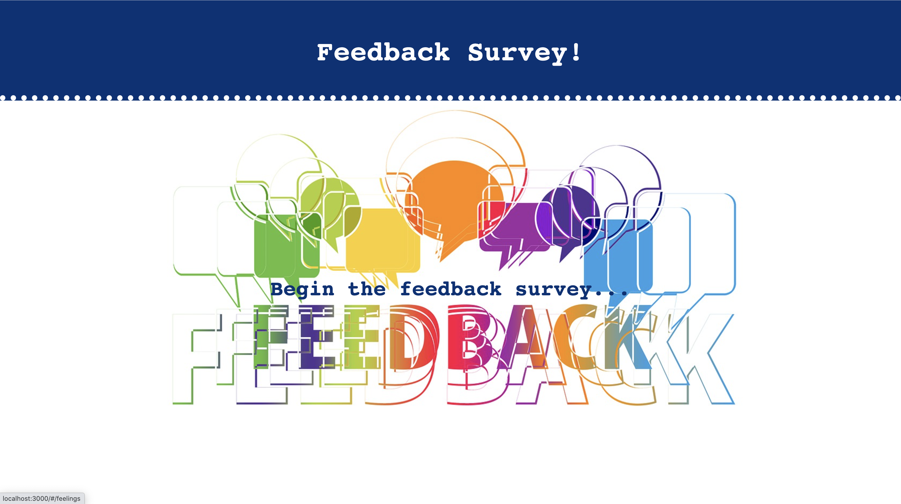
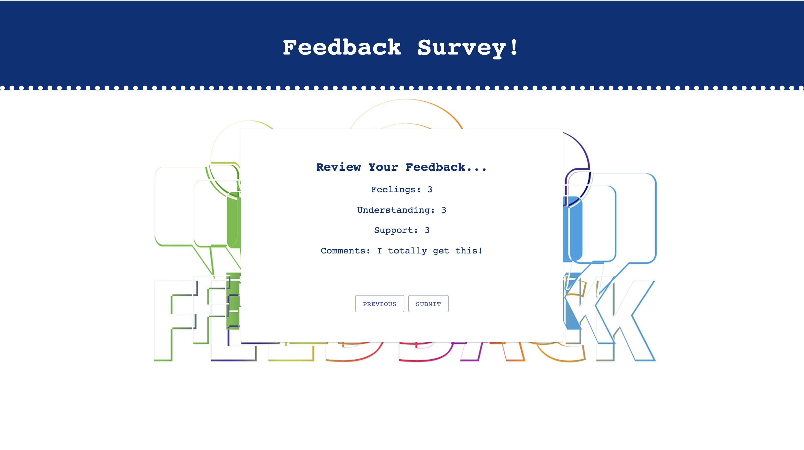

# PROJECT NAME

REDUX FEEDBACK LOOP

## Description

_Duration: 12 Hours_

This is a feedback survey that allows the user to provide a 1 - 5 scaled answer to the questions. They are able to go back and re-submit their answers if they choose to change an answer before submitting the completed survey. There is an admin view that accessible, which displays all of the completed feedback surveys. Admin may flag feedback for future review.

## Screen Shot

### Prerequisites - dependencies

- [Node.js](https://nodejs.org/en/)
- [postgreSQL](https://www.postgresql.org/download/)
- [react-redux](https://redux.js.org/introduction/installation)
- [materialUI](https://material-ui.com/getting-started/installation/)

### SQL Requirements
- PostgreSQL

1. Create a postgres SQL database named `prime_feedback` using an app like Postico.
2. The queries in the `data.sql` file are set up to create all the necessary tables and populate the needed data to allow the application to run correctly. 
3. Open up your editor of choice and run an `npm install` - this will install the dependencies - `express.js`, `node.js`, `react-redux`, `react-router-dom`, `redux-logger`, `axios`, `materialUI-core`, `materialUI-icon`, `nodemon`, `react-moment`, and `pg`.
4. Run the server first `npm run server`.
5. Run the client second (in a separate terminal) `npm run client`.
6. The `npm run client` command will open up a new browser tab for you!

## Usage

1. Users enter their feedback on four separate screens.
2. Once a rating or comment is input, it will allow you to move to the next screen.
3. If you want to edit your previous input, you may go to the previous page and re-input your feedback.
4. Once you arrive at the review page, you can submit your feedback and it will be stored in a database.
5. The admin page allows the user to review previous feedback submissions, they are listed with the most previous feedback date at the top. The user can flag the feedback for future review and remove the feedback from the database.

## Built With

List technologies and frameworks here
- HTML
- CSS
- javaScript
- react
- redux
- node
- axios
- nodemon
- express
- postgreSQL
- material UI-core
- material UI-icon
- react-moment

## License

## Acknowledgement

Thank you to Josie, for being my coding buddy. Thank you to Steven for supporting me and answering all my questions. Thanks to [Prime Digital Academy](www.primeacademy.io) who equipped and helped me to make this application a reality. Special thanks to my primary instructor, 
-[Mary Mossman](https://github.com/mbMosman)
-[Josie Fredericksen](https://github.com/freder48)
-[Steven Maloney](https://github.com/sdeda1us)

## Support

If you have suggestions or issues, please reach out to me on linkedIn [https://www.linkedin.com/in/kimberly-orchard-she-her-49b0171b9/]
